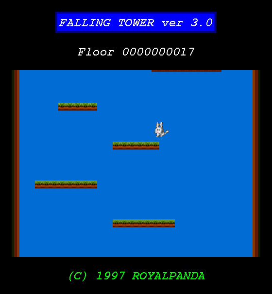

# Xjump 3.0

This is a reimplementation of the classic Xjump game, using SDL instead of Xlib.
In a post-Wayland world, the old implementation was growing increasingly
obsolete and harder to compile on modern systems.

    

## New features and improvements

- New default theme
- Increased the FPS from 40 to 60
- Smooth scrolling animations
- Game window is now resizable
- More responsive controls (when pressing left and right simultaneously)

## Installation instructions

To compile xjump, use the provided configure script and makefile.
You can choose a different installation location by passing certain flags to the configure script.
See `./configure --help` for details.

    ./configure
    make && sudo make install

## Required dependencies

To compile xjump we need the header files for SDL2.
On Debian-based Linux distributions these can be found in the `libsdl2-dev` package.
On Fedora the package you need is `SDL2-devel`.

## Breaking changes

This version of Xjump does not have a global highscore file.
Although Xjump highscores are dear to my heart, that feature added a lot of complexity to the system.

## FAQ

1. Isn't this the same thing as [GNUjump](http://www.gnu.org/software/gnujump/) aka SDLjump?

    This version of xjump tries to keep the interface closer to the original xjump.
    For example, it launches straight into the game instead of into a menu.
    The smooth scrolling feature is inspired by GNUjump though :)

2. How do I make things look like they did in the classic xjump?

    Use the following command-line flags: `xjump --hard-scroll --theme classic `
